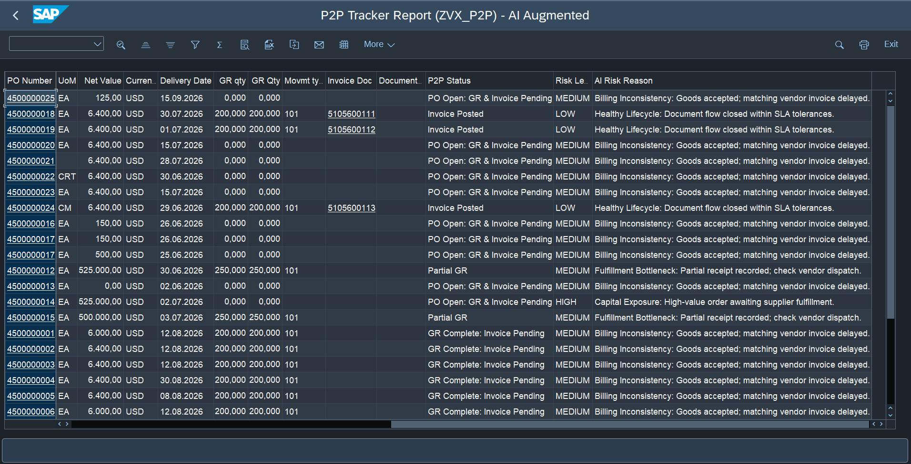

# Enterprise Procure-to-Pay (P2P) Lifecycle Tracker

An end-to-end custom SAP ABAP tracking dashboard (`ZVX_P2P`) built to monitor real-time procurement, goods movements, and invoice verification workflows across enterprise landscapes.

## 📌 Business Overview
In large enterprise supply chains, tracking procurement lifecycles across multiple modules (SAP MM and FI) often leads to operational bottlenecks and delivery delays. This report consolidates standard documents into a single real-time operational dashboard with interactive drill-down navigation.

## 🚀 Key Features
* **Multi-Table Consolidation:** Real-time correlation across procurement and finance tables (`EKKO`, `EKPO`, `EKET`, `MSEG`, `RSEG`, `BSEG`).
* **5-Level Automated Status Classification:**
  1. `PO Open: GR & Invoice Pending`
  2. `Partial GR`
  3. `GR Complete: Invoice Pending`
  4. `Invoice Posted`
  5. `Fully Cleared`
* **Modern Object-Oriented ALV:** Built using `CL_SALV_TABLE` with column optimization, custom headers, and key fixation.
* **Interactive Drill-Down Hotspots:** One-click navigation to standard SAP transactions:
  * PO Number $\rightarrow$ `ME23N` (Display Purchase Order)
  * Invoice Document $\rightarrow$ `MIR4` (Display Invoice Document)

## 📊 Live Execution Output

## 🛠️ Technical Specifications
* **Environment:** SAP NetWeaver / SAP ECC 6.0 & SAP S/4HANA Compatible
* **Language:** SAP ABAP 7.5+
* **Data Access:** Optimized Open SQL joins minimizing round-trips
* **User Interface:** Selection-Screen with filtering parameters & OO-ALV Grid
